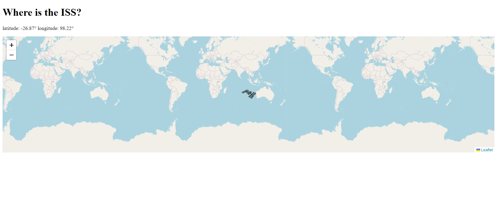

# Where is ISS

---

---

The International Space Station with ESA’s Columbus laboratory flies 400 km high at speeds that defy gravity – literally. At 28 800 km/h it only takes 92 minutes for the weightless laboratory to make a complete circuit of Earth. Astronauts working and living on the Station experience 16 sunrises and sunsets each day.

Due to the Station's orbit it appears to travel from west to east over our planet, and due to Earth's own rotation the Space Station's moves 2200 km to the west on each orbit. You can see the International Space Station with your own eyes from here

## Demo

Here is a working live demo :[Demo](https://asiyegokalp.github.io/Quiz-App/)
